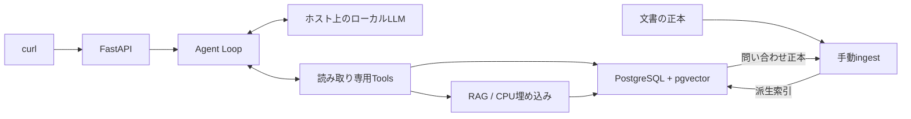

# LogiScope

[](https://github.com/philippos2/logi-scope/actions/workflows/ci.yml)

**業務データとRAGを横断調査する Tool-calling Agent Loop のデモ。**

物流会社の架空データを題材に、自然言語の質問からLLMがToolを選び、結果を観測して次の調査を進め、根拠と未解決事項を返します。案件獲得用ポートフォリオとして、Agentの設計・実装・検証を示すPoCです。

> **Agent APIまで実装・検証済みです。** 実モデルのA〜Eは各2回、10件中10件成功。自動テストは141件中141件成功です。`POST /agent`からローカルLLM・業務DB・RAGを使って調査できます。

## 示すこと

- 顧客・荷物・配送イベントの構造化検索と、日本語文書・過去問い合わせのRAG検索。
- 前段の検索結果を次のToolへ利用する複数段階の調査。
- 根拠付き回答とTool実行履歴。情報不足・曖昧性の明示。
- 引数検証、重複防止、例外処理、上限によるAgent Loopの制御。
- 有料クラウドLLMに依存しないローカル再現性。

問い合わせ別の固定処理フローを作るデモではありません。LLMが次の操作を選びます。モデル内部のChain-of-Thoughtは記録・公開しません。

## 構成と正本

LLMはホスト上で実行し、OpenAI互換APIで接続します。Tool実行結果を観測して次の操作を選びます。



業務テーブルが顧客・荷物・配送イベント・問い合わせの正本、`seed/docs`のMarkdownが文書の正本です。チャンクと埋め込みは再生成可能な派生データです。過去問い合わせの検索結果から、IDで正本を取得します。

ORMはSQLAlchemy、マイグレーションはAlembic、テストはpytestを採用します。構成の詳細と未決定事項は[設計書](docs/design.md)に記載しています。

## 実装済みのTool

| Tool | 動作 |
|---|---|
| `search_customers` | `customer_name`の部分一致で候補を返す。`branch`で営業所を絞り込める |
| `search_shipments` | `customer_id`または`shipment_id`で検索。両方指定すると両条件で絞る |
| `get_shipment_details` | 荷物IDで状態と配送イベントを取得。関連する障害IDを返す |
| `get_inquiry` | `inquiry_id`から問い合わせの正本と対応内容を取得 |
| `search_knowledge` | 文書・問い合わせの派生チャンクをベクトル検索。種類と荷物・障害IDで絞り込める |

登録済みToolのみを呼び出し、Pydanticで未知フィールド・不正な型・空の条件を拒否します。数値文字列やboolをIDへ自動変換しません。顧客名の`%`・`_`はワイルドカードではなく文字として検索します。同名候補を任意に選ぶ処理はありません。

結果は`records`、取得済みレコードを識別する`sources`、省略を示す`truncated`を持ちます。検索件数は既定10・最大20、配送イベントは既定20・最大20、本文は各項目2,000文字に制限します。空の検索結果は正常結果です。DB例外は公開用コードに置き換え、各Toolに15秒のタイムアウトを設けます。DBセッションはToolの処理内で閉じます。

Toolを個別のHTTP APIとして公開せず、Agent Loopから呼び出します。`search_knowledge`にはロード済みの埋め込みモデルを渡します。業務Toolだけを使う場合はモデルをロードする必要はありません。

## Agent Loop

`src/logi_scope/agent.py`でLLM応答・Tool実行・最終応答を分離しています。LLMが操作を選び、呼び出しIDに対応する結果を次のLLM要求へ戻します。問い合わせ別の固定フローはありません。

- LLM呼び出しとTool試行数を別々に制限。不正・重複も予算を消費します。
- 引数修正は1回。同じ操作は正規化した引数で検出し、成功結果を再利用します。
- 無進展の反復・例外・時間超過では停止し、履歴と未解決事項を返します。
- 顧客検索が複数候補または省略ありの場合は停止し、特定に必要な情報を求めます。
- `steps`は実行側で生成し、根拠は取得済みIDへ照合。問い合わせチャンクの引用には正本の取得・引用も必要です。

打ち切り後の回答専用LLM呼び出しは最大1回で、全体の時間制限内に収めます。最終化も失敗した場合は制御された応答を返します。初期値と詳細は[設計書](docs/design.md#6-agent-loop)を参照してください。偽LLMの制御テストと、実モデルによるA〜Eの受入確認を分離しています。

## API

```bash
curl -X POST http://localhost:8000/agent \
  -H 'Content-Type: application/json' \
  -d '{"question":"デモ青空商店の荷物が遅延している原因は？"}'
```

応答は`answer`（回答）、`sources`（照合済み根拠）、`steps`（実行操作）、`unresolved`（未解決事項）。Toolを何回・どの順で使うかは利用者が指定しません。入力不正は422、LLM接続障害は502、初回LLM時間超過は504、未準備・実行中は503です。回答不能・曖昧性・制御された部分回答は200で未解決事項を返します。

## デモシナリオ

| シナリオ | 確認する振る舞い |
|---|---|
| A: 単純検索 | 業務データによる回答、根拠、実行履歴 |
| B: 複数段階の調査 | 前段の結果を利用し、業務データと報告文書を統合 |
| C: 非構造化検索 → 正本取得 | 類似問い合わせの検索後、対応する正本を追加取得 |
| D: 回答不能 | 存在しない荷物を捏造せず、未解決事項を返す |
| E: 曖昧性 | 同名顧客を勝手に選ばず、追加情報を求める |

架空データは`seed/business.json`と`seed/docs/*.md`にあります。質問例は[セットアップガイド](docs/getting-started.md#db準備)に記載しています。実接続の確認には下記の検証スクリプトを使用します。[受入条件](docs/requirements.md#9-デモシナリオと受入条件)

## セットアップ・データ準備・起動

Docker Engine・Composeと、ホスト上のOllamaが必要です。[セットアップガイド](docs/getting-started.md)で検証環境、モデル取得、WSLの待ち受け設定、UID/GID、DB権限を説明しています。先にホスト上のモデルを準備してください。

```bash
git clone https://github.com/philippos2/logi-scope.git
cd logi-scope
cp .env.example .env
# .envの3つのパスワードとLOCAL_UID/LOCAL_GIDを編集
docker compose up -d --build
docker compose run --build --rm manage init
docker compose run --rm manage seed
docker compose run --build --rm ingest
docker compose exec app bash
```

コンテナ内の作業場所は`/home/developer/work/logi-scope`。ホストのソースをマウントし、非rootユーザーと`/opt/venv`で作業できます。続けてコンテナ内でAPIを起動します。

```bash
uv run --locked uvicorn logi_scope.api:app --host 0.0.0.0 --port 8000 --reload
```

起動完了後、別のホスト窓から上記のcurlを実行します。`GET /health`は生存確認のみ。モデルはGitやアプリイメージに含めず、LLMはOllama側、CPU埋め込みモデルはDockerのキャッシュへ置きます。業務DB・文書が正本で、ingestは問い合わせと文書から索引を再生成します。通常停止は`docker compose down`、`-v`を付けるとDBと埋め込みキャッシュを削除します。

## テスト

```bash
docker compose exec app uv run --locked pytest
```

通常のテストは外部サービスなしで実行します。実DBテストは既定でスキップし、DB準備後に管理サービスで明示的に実行します。

```bash
docker compose run --rm --entrypoint uv -e LOGISCOPE_DB_TESTS=1 manage run --locked pytest
docker compose run --rm --entrypoint uv manage run --locked alembic check
```

DBテストは実PostgreSQLで、ORMの関連取得・同名候補・不存在・seed再実行・FK・pgvector拡張・読み取り専用ロールを確認します。書き込み拒否はトランザクションのread-only設定を解除してもDB権限で拒否されることを検証します。テスト用の更新はロールバックします。管理認証情報はアプリサービスに渡しません。

最新の自動テストは141件中141件成功（失敗・スキップ0件）。通常実行では111件成功・実DB30件スキップです。実埋め込みモデル単独の検証は[ガイド](docs/getting-started.md#ragの準備と事前検証)のスクリプトで分離します。[過去の検証記録](docs/history/foundation-verification.md)

実モデル・API・DB・RAGを通したA〜Eの確認は、API起動後に実行します。

```bash
docker compose exec app uv run --locked python scripts/verify_demo.py --repeat 2
```

2026-10-06に5シナリオ各2回、10件中10件成功。モデル常駐後のケース時間は4.97〜16.44秒でした。小規模な架空データでの結果です。空のDB・埋め込みキャッシュを使った別環境でも5件中5件成功しました。[再現性確認](docs/history/reproducibility-verification.md)

公開応答とケース別判定はGit対象外の`artifacts/demo-verification.json`へ保存します。内部推論・生LLM応答は保存しません。実測結果と初回の修正経緯は[Agentデモ検証履歴](docs/history/agent-demo-verification.md)に記載します。

## CI

[GitHub Actions設定](.github/workflows/ci.yml)で、main向けPR・mainへのpush・手動実行時にDockerビルド、空のDBへのマイグレーション、架空seed、全自動テスト、`alembic check`を実行します。標準Ubuntu runnerと使い捨てDBを使用し、GitHub Secretsの登録は不要です。

RAG統合テストには`tests/prepare_database.py`で決定論的なベクトルを準備します。実LLM・実埋め込みモデルの品質検証はCIに含めず、上記のローカル実接続検証で行います。テスト用索引の準備は実デモDBに対して実行しないでください。CI結果のマージ必須化はGitHub側のブランチ保護設定が別途必要です。

## Known Limitations

- 検証対象は小規模な架空データと5つの質問。任意の質問に対する品質保証ではありません。
- 同時実行は1件。実行中の追加リクエストは503で返します。
- LLMは不要な追加検索を行う場合があります。回数・時間の上限で制御します。
- 実行速度・Tool Calling品質・日本語検索品質は採用モデルとホスト性能に依存します。
- 架空データのみを対象とする、単一利用者向けの読み取り専用PoCです。
- GUI、認証、マルチテナント、ストリーミング、高度な検索改善、本番デプロイは対象外です。
- 参照元の検証だけで回答の事実性を完全保証するものではありません。

## 本番化する場合

利用者・組織ごとの認証と参照権限、個人情報保護、運用監視、負荷・信頼性評価、秘密管理、データ更新運用、モデル変更時の評価などが別途必要です。本PoCの実装範囲には含めません。

## 文書と開発用skills

- [セットアップ・実行ガイド](docs/getting-started.md)
- [要件・制約・受入条件](docs/requirements.md)
- [設計・技術選定・未決定事項](docs/design.md)
- [ローカルLLM選定・事前検証の履歴](docs/history/local-llm-selection.md)
- [基盤実装・検証の履歴](docs/history/foundation-verification.md)
- [別環境での再現性確認](docs/history/reproducibility-verification.md)
- [Agentデモの実接続検証](docs/history/agent-demo-verification.md)
- [AGENTS.md](AGENTS.md)
- [ローカルTool Calling検証skill](.agents/skills/verify-local-tool-calling/SKILL.md)
- [デモシナリオ検証skill](.agents/skills/verify-demo-scenarios/SKILL.md)

skillsは開発支援用の手順です。実行時Agentの機能ではありません。
