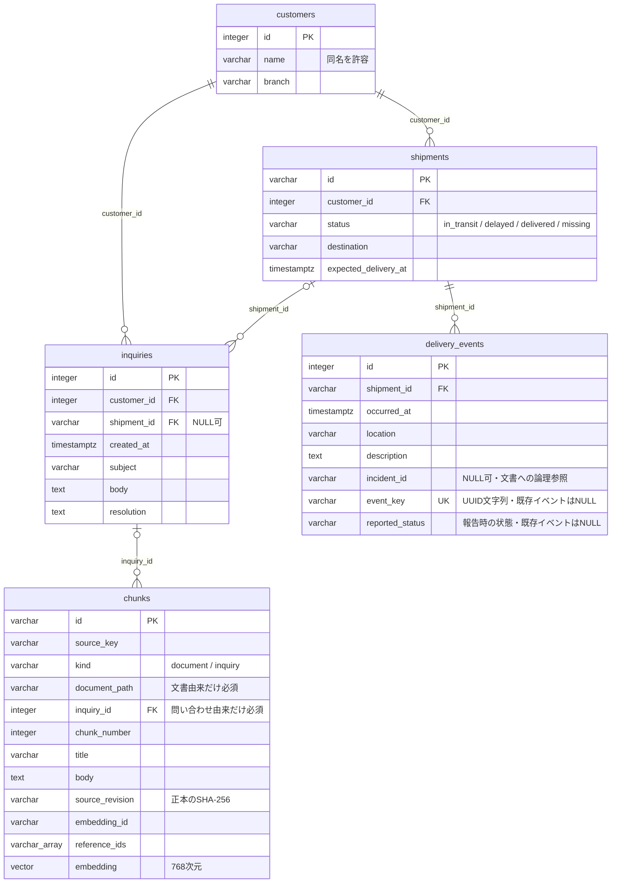

# DBスキーマ・ER図

業務の正本となる4テーブルは実装・マイグレーション適用済み。RAG用の`chunks`を768次元の派生インデックスとして追加した。`alembic_version`はマイグレーション管理用であり、下図には含めない。

定義の管理元は[ORMモデル](../src/logi_scope/db/models.py)と[マイグレーション一覧](../migrations/versions/)。スキーマ変更時にはこの図も更新する。



chunksの文書パスと問い合わせFKは、由来に応じて一方だけを持つことをDBのCHECK制約で強制する。`source_key`＋`chunk_number`は一意。問い合わせ削除時は、その派生チャンクもFKのCASCADEで削除する。chunksは正本ではなく、ファイルと問い合わせから再生成する。

問い合わせは必ず顧客に属するが、特定の荷物に属さない問い合わせも格納できる。障害報告は`seed/docs`のファイルが正本なので、`incident_id`はDBテーブルへのFKではない。問い合わせの顧客FKと荷物FKは独立しており、両者の顧客一致を強制する複合制約は現時点では持たない。

## DBeaverで確認する

通常のCompose構成はDBポートをホストに公開しない。GUIで確認するときだけ、追加のComposeファイルでWSLホストのlocalhostへ公開する。

```bash
docker compose -f docker-compose.yml -f docker-compose.db-tools.yml up -d db
```

通常の`docker compose run manage ...`などでも公開設定を維持したい場合は、Git対象外のローカル`.env`へ次の行を追加する（WSL/Linux）。

```dotenv
COMPOSE_FILE=docker-compose.yml:docker-compose.db-tools.yml
```

DBeaverでPostgreSQL接続を作成する。

| 項目 | 値 |
|---|---|
| Host | `127.0.0.1` |
| Port | `15432` |
| Database | `logi_scope` |
| Username | `logi_scope_reader` |
| Password | ローカル`.env`の`POSTGRES_READER_PASSWORD` |

WSL側で動くDBeaverから接続する設定。Windows側のDBeaverからのlocalhost転送はこの環境では未検証。通常の閲覧には読み取り専用ロールを使い、管理操作が必要な場合だけ管理ロールを使う。

`public`スキーマのテーブル・列・FKを確認できる。スキーマを開いて「Diagram」タブを選ぶと、実DBからER図を表示できる。[DBeaver公式資料](https://dbeaver.com/docs/dbeaver/ER-Diagrams/)

公開設定を維持する`.env`の行を追加した場合は、その行を削除してから通常の構成でDBを再作成するとポート公開を解除できる。named volumeのデータは維持される。

```bash
docker compose up -d db
```

接続・閲覧の実測結果は[基盤検証履歴](history/foundation-verification.md#dbスキーマの閲覧確認)を参照する。

読み取り専用ロールには`alembic_version`のSELECT権限を付与しないため、この管理テーブルの閲覧は権限エラーとなる。業務テーブルの閲覧には影響しない。マイグレーション状態を確認する場合は管理ロールの接続を使う。

### 配送状態による一覧検索

`shipments.status`は`in_transit`（配送中）、`delayed`（遅延）、`delivered`（配達完了）、`missing`（所在不明として登録済み）を扱う。所在不明は遅延と別であり、紛失・盗難の確定を意味しない。`0003_missing_shipments`でCHECK制約を拡張する。ダウングレードはmissingレコードが残っている場合、データを変換・削除せず拒否する。

## 配送更新デモ

`0004_delivery_updates`でdelivery_eventsに、重複送信を識別する一意な`event_key`と、そのイベントで報告した状態`reported_status`を追加する。既存イベントでは両方NULL。新規イベントIDは1000000からの専用シーケンスで払い出す。`logi_scope_updater`は荷物・配送イベントのSELECT、荷物のstatus列のみUPDATE、配送イベントのINSERT、シーケンスのUSAGEを持つ。既存イベントの更新・削除、顧客・問い合わせ・chunksの書き込み権限は与えない。更新用イベントが残る間はダウングレードを拒否する。[専用設計](delivery-updates.md)を参照する。
