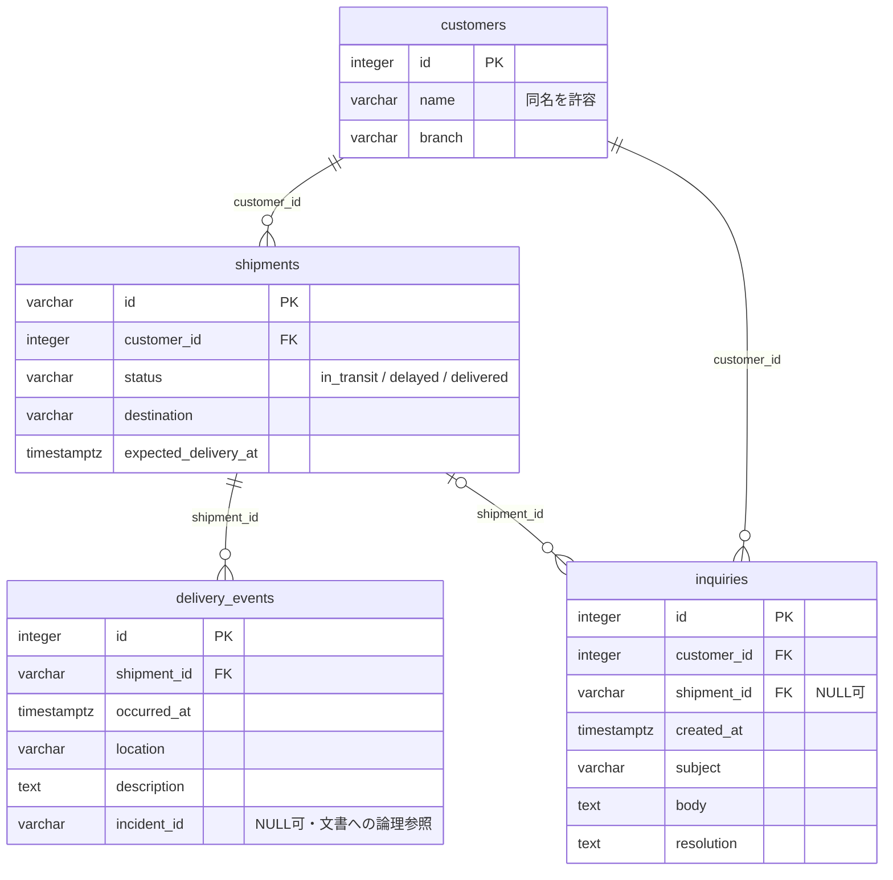

# DBスキーマ

業務の正本となる4テーブルは実装・マイグレーション適用済み。RAG用の`chunks`は埋め込みモデルの次元確定後に追加する。`alembic_version`はマイグレーション管理用であり、下図には含めない。

定義の管理元は[ORMモデル](../src/logi_scope/db/models.py)と[マイグレーション](../migrations/versions/0001_business_data.py)。スキーマ変更時にはこの図も更新する。



問い合わせは必ず顧客に属するが、特定の荷物に属さない問い合わせも格納できる。障害報告は`seed/docs`のファイルが正本なので、`incident_id`はDBテーブルへのFKではない。問い合わせの顧客FKと荷物FKは独立しており、両者の顧客一致を強制する複合制約は現時点では持たない。

## DBeaverで確認する

通常のCompose構成はDBポートをホストに公開しない。GUIで確認するときだけ、追加のComposeファイルでWSLホストのlocalhostへ公開する。

```bash
docker compose -f docker-compose.yml -f docker-compose.db-tools.yml up -d db
```

DBeaverでPostgreSQL接続を作成する。

| 項目 | 値 |
|---|---|
| Host | `127.0.0.1` |
| Port | `15432` |
| Database | `logi_scope` |
| Username | `logi_scope_reader` |
| Password | ローカル`.env`の`POSTGRES_READER_PASSWORD` |

WSL側で動くDBeaverから接続する設定。Windows側のDBeaverからのlocalhost転送はこの環境では未検証。通常の閲覧には読み取り専用ロールを使い、管理操作が必要な場合だけ管理ロールを使う。

`public`スキーマのテーブル・列・FKを確認できる。スキーマを開いて「Diagram」タブを選ぶと、実DBからER図を表示できる。[DBeaver公式資料](https://dbeaver.com/docs/dbeaver/ER-Diagrams/)

確認後、通常の構成でDBを再作成するとポート公開を解除できる。named volumeのデータは維持される。

```bash
docker compose up -d db
```

2026-10-06に追加構成を適用し、WSLホストの15432番ポートへのTCP接続を確認した。利用者のDBeaverからも業務4テーブルのスキーマ・データを閲覧できることを確認済み。DBeaverの実行OSは未確認。

読み取り専用ロールには`alembic_version`のSELECT権限を付与しないため、この管理テーブルの閲覧は権限エラーとなる。業務テーブルの閲覧には影響しない。マイグレーション状態を確認する場合は管理ロールの接続を使う。
