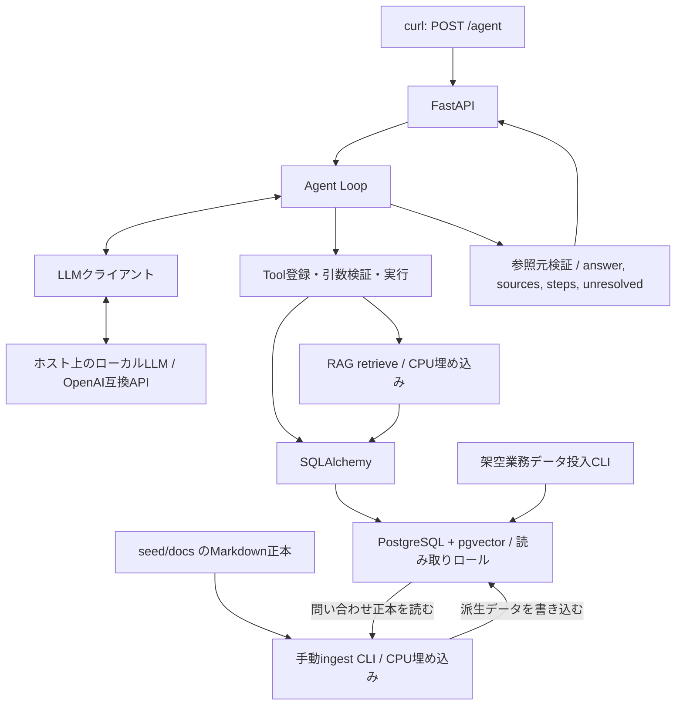

# LogiScope — 設計

状態: 実装前。要件レビューの明確化を反映した設計方針であり、動作検証済みの実装ではない。

## 1. レビューと決定事項

[requirements.md](requirements.md)は公開ポートフォリオ用PoCとして実現可能。FastAPI・SQLAlchemy・Alembic・pytestを既存合意として固定した。配送イベント確認、過去問い合わせのingest、IDによる正本取得を能力要件へ明記した。

検索結果の統合と、存在しない事実の生成を区別する。類似事故報告だけで遅延原因を断定しない。5シナリオは必要な振る舞いを検証し、固定Tool順序を実装しない。

## 2. 構成



業務テーブルと文書が正本。DB内のchunksは派生インデックス。ingestはAPIとは別プロセスで手動実行する。バックグラウンドジョブ基盤は導入しない。

## 3. 技術と選定理由

| 役割 | 採用方針 | 理由 |
|---|---|---|
| API | FastAPI | 入出力検証とHTTP APIを簡潔に構成できる |
| 検証 | Pydantic | API・Tool引数・応答契約を型で定義する |
| ORM | SQLAlchemy | 関連・トランザクション・pgvector検索を一貫して扱う |
| DB変更 | Alembic | 再現可能なマイグレーション |
| DBドライバー | Psycopg 3 | PostgreSQL接続と非同期処理 |
| ベクトル連携 | pgvector-python | SQLAlchemyのベクトル型・距離式 |
| LLM通信 | HTTPX | OpenAI互換HTTP APIを薄いアダプターで扱う |
| 埋め込み | Sentence Transformers | CPUで日本語対応モデルを実行する |
| テスト | pytest / pytest-asyncio | fixture・パラメーター化・非同期の振る舞い検証 |
| 起動 | Docker Compose | アプリとDBの再現性。LLMはホスト側 |

Agentフレームワークは初期版では導入しない。狭いLoopだけを実装し、通信・ORM・検証・埋め込み等はライブラリを使う。依存関係は実装時に互換性を検証して固定する。

アプリは公式PythonイメージのDebian slim系を使用する。Python 3の比較的新しい安定版を、埋め込み関連を含む互換性確認後に選ぶ。タグにPython版とDebianコードネームを明示する。DBはPostgreSQL＋pgvectorの専用イメージに分ける。具体的な版は未確定であり、Python要件・依存ロック・Dockerfile/Composeを実行設定の管理元とする。

## 4. API契約

`POST /agent`に空でない日本語中心の`question`を送る。入力文字数上限は設定・検証する。会話セッションは初期版では持たず、曖昧性がある場合は必要情報を含めた新しい質問を送る。

正常な調査結果はHTTP 200。回答不能や曖昧性、制御された部分回答も200とし、`unresolved`で区別する。入力不正は422。調査を成立させられないLLM接続障害等は適切な5xxで返し、成功結果を装わない。具体的な障害応答契約はAPI実装時に確定する。

```json
{
  "answer": "対象を一意に特定できませんでした。顧客IDを指定してください。",
  "sources": [
    {"id": "customer:101", "kind": "customer", "record_id": 101},
    {"id": "customer:102", "kind": "customer", "record_id": 102}
  ],
  "steps": [
    {"tool": "search_customers", "args": {"name": "顧客A"}, "ok": true}
  ],
  "unresolved": [
    {"code": "ambiguous_target", "message": "同名顧客が複数あります。", "details": {"required_fields": ["customer_id"]}}
  ]
}
```

これは契約例であり実行結果ではない。`sources`の`kind`に応じて`record_id`、`path`、`chunk_id`、正本への参照を持たせる。問い合わせ検索の場合はチャンクと正本の両方を追跡可能にする。引用を本文へ反映する方式と詳細型は実装時に確定する。

`steps`はアプリ側で記録する。実行済みの成功/失敗だけを含め、`ok`は操作の成功を表す。失敗には公開用の分類コードを追加できるが、内部例外・スタックトレースは公開しない。未実行の引数拒否・キャッシュ再利用は実行履歴へ混ぜない。

`unresolved`は`code`、`message`、任意の`details`。想定コードは`not_found`、`ambiguous_target`、`insufficient_evidence`、`tool_error`、`invalid_tool_arguments`、`step_limit`、`no_progress`、`timeout`。

## 5. Toolの構成方針

名前と分割は暫定。能力を満たす範囲で調整できる。

- `search_customers`: 名前等から候補を返す。複数候補を隠さない。
- `search_shipments`: 顧客ID・荷物ID等で検索する。
- `get_shipment_details`: 配送状態・配送イベント・事故参照などを返す。
- `search_knowledge`: 文書と過去問い合わせチャンクを検索し、正本の識別情報を返す。
- `get_inquiry`: 問い合わせIDで正本を取得する。

PydanticモデルからTool引数スキーマを定義し、未知のTool・余分なフィールド・不正な型を拒否する。ORM検索の列や演算子をLLMへ自由指定させない。結果件数・本文長を制限し、省略があれば明示する。空の検索結果は正常、DB障害は失敗とする。

## 6. Agent Loop

LLMクライアント、Toolレジストリ、結果・参照元の型、Loopを分離する。LLMが選んだToolを検証して実行し、呼び出しIDと対応する結果を履歴に戻す。実行結果の履歴はリクエストごとに保持する。

| 制御 | 方針 |
|---|---|
| 上限 | LLM呼び出し回数とTool呼び出し試行数を別々に数える。不正・重複も予算を消費する |
| 引数修正 | 検証エラーをTool結果として返す。1件の不正呼び出しに対する修正機会は1回。LLM呼び出しは全体上限に算入 |
| 重複 | Tool名＋検証・正規化した引数でリクエスト内比較。成功結果は再利用、無進展の反復は終了 |
| 失敗 | 公開可能なエラー分類をLLMに返す。無制限な再試行をしない |
| 時間 | 全体・LLM・DB/Toolに有限の期限。設定可能とし遅いローカル推論に合わせる |
| 複数Tool | 初期版は逐次実行。対応する呼び出しIDと結果を維持し、残り予算を超える呼び出しは実行しない |
| 最終応答 | LLMの回答・未解決事項を検証し、実行側のstepsと取得済みsourcesを合わせる |
| 打ち切り | 新たなTool実行を止める。残り時間内の回答専用LLM呼び出しは最大1回、追加呼び出しと明示して扱う |

最終化も失敗した場合は、取得済み参照元・stepsと終了理由を使った制御されたフォールバックJSONを返す。LLMが生成していない原因説明をアプリ側で創作しない。

回答に付けるsourcesは取得済みレジストリに照合する。この照合は参照元の存在を確認するもので、回答の事実性の完全保証ではない。日本語シナリオの受入確認で事実との一致を検証する。

文書やTool結果はデータであり命令ではない。システム方針・利用者質問・Tool結果をメッセージの役割で区別する。内部推論は保存・公開せず、生LLM応答を丸ごとログへ書かない。

## 7. DB・権限

業務モデルは顧客、荷物、配送イベント、問い合わせ。Bの事故報告は対象荷物の配送イベントと共通の架空事故ID等で結び付け、拠点・時刻も整合させる。文書内の事故IDはファイル正本への論理参照でありDBのFKではない。

chunksには本文、種別、文書パスまたは問い合わせFK、チャンク番号、正本の更新識別子、埋め込みモデル識別子、ベクトルを持たせる。問い合わせ由来と文書由来の参照を制約で区別する。ベクトル次元は採用モデル確定後に決める。

- 実行用: 必要な業務・検索テーブルのSELECTのみ。所有者・スーパーユーザーにしない。
- seed/ingest用: 必要な投入・派生更新権限。アプリの環境へ渡さない。
- マイグレーション用: スキーマ・拡張・権限管理用。

DB Sessionは短いTool処理内で閉じる。LLM待ちの間は保持しない。並行処理で同一AsyncSessionを共有しない。初期版のTool実行は逐次。

## 8. RAGと再生成

文書は`seed/docs/*.md`、問い合わせはDB正本から読み込む。文書は見出し・段落を基準にチャンク化し、問い合わせはIDと正本参照を維持する。

ingestとretrieveは同じ埋め込みモデル・版・次元・設定を使う。モデルが要求するquery/document用入力形式はそれぞれ遵守する。モデルはプロセス起動時にロードし、CPU処理をAPIのイベントループで直接長時間実行しない。

小規模なPoCでは近傍の完全検索から開始する。拠点・期間・文書種別の簡単なフィルター、業務IDの完全一致は許容する。リランキングや高度なハイブリッド検索は初期範囲に含めない。

初期版は全件再生成方式を基本とする。同じ入力で重複を増やさず、削除文書も反映する。埋め込みを生成し終えてから短いトランザクションで対象派生データを置換し、途中失敗で一部だけ公開しない。モデル変更時は必要なスキーマ変更と全件再生成を行う。

## 9. 検証

### ローカルLLMの事前検証

同じOpenAI互換エンドポイントで、日本語質問→Tool呼び出し→結果投入→最終回答、多段のID引き継ぎ、該当なし、複数候補、引数修正を小さなメモリ上の架空Toolで検証する。モデル名、サーバー版、量子化、コンテキスト、推論設定、ハードウェア、所要時間を記録する。数回繰り返して安定性を確認する。検証用の簡略データと完成デモのDB実装を区別する。

### 自動テスト

- 単体/制御: 偽LLMの規定応答で多段調査・引数修正・未知Tool・重複・例外・上限・不明・曖昧性を検証する。
- DB統合: 実PostgreSQL/pgvectorで検索、関連、正本参照、再ingest、読み取り権限を検証する。SQLiteで代替しない。
- 実LLM: A〜Eを実接続で確認する。自動テストの成功を実LLMによる自律選択の証明としない。

期待事実・根拠ID・必須の依存関係・未解決コードで判定し、文章や不要なTool順序を完全一致させない。実行した環境と結果を記録し、未実行を成功扱いしない。

## 10. ディレクトリ方針

```text
logi-scope/
  AGENTS.md
  README.md
  docs/{requirements,design}.md
  .agents/skills/<skill-name>/SKILL.md
  src/logi_scope/              # API、Loop、Tools、DB、RAG、設定
  tests/                      # 決定論的・DB統合テスト
  seed/docs/                  # 架空文書の正本
  migrations/                 # Alembic
  scripts/                    # 必要になった検証・準備用CLI
```

実装ディレクトリは将来の構成案。現時点では文書とskillsだけを作成する。秘密値は環境変数へ置き、将来の`.env.example`にはダミー値だけを書く。

## 11. 実装順序

1. 設計文書・作業指針・検証skillsを公開する。
2. ホスト環境を確認し、ローカルLLMのTool Callingを検証する。
3. DBモデル・マイグレーション・権限・架空seedを準備する。
4. 業務Toolsとテストを実装する。
5. 文書/問い合わせingest・検索を実装する。
6. 偽LLMを使ってLoop制御とテストを実装する。
7. APIを統合し実LLMでA〜Eを検証する。
8. Docker再現手順、デモ実行例、制限、検証結果をREADMEへ反映する。

## 12. 未決定事項

- ホストのOS、RAM、GPU/VRAM、利用可能なローカルLLM環境。
- LLMモデル、サーバー選択、量子化、コンテキスト設定、モデルのライセンス。
- 日本語埋め込みモデル、版、次元、ライセンス、実測品質。
- 上限回数・時間・入力長・検索件数・チャンクサイズの初期値。
- sourcesの詳細型と本文中の引用方式、障害時API応答の詳細。
- パッケージ管理ツールと依存版、DockerからホストLLMへのOS別接続方法。

不足情報は実装の該当段階で確認する。モデル性能や実行時間を未検証のまま保証しない。

## 参考資料

- [FastAPI: 非同期処理](https://fastapi.tiangolo.com/async/)
- [SQLAlchemy: Sessionの管理](https://docs.sqlalchemy.org/en/20/orm/session_basics.html)
- [Alembic: マイグレーション自動生成](https://alembic.sqlalchemy.org/en/latest/autogenerate.html)
- [pgvector-python: SQLAlchemy連携](https://github.com/pgvector/pgvector-python)
- [Ollama: OpenAI互換API](https://docs.ollama.com/api/openai-compatibility)
- [llama.cpp: Tool Calling](https://github.com/ggml-org/llama.cpp/blob/master/docs/function-calling.md)
- [Sentence Transformers: 埋め込み](https://www.sbert.net/docs/sentence_transformer/usage/usage.html)
- [pytest: fixtures](https://www.pytest.org/en/latest/explanation/fixtures.html)
