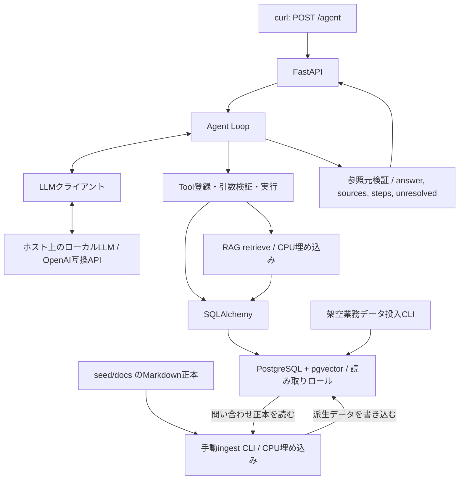

# LogiScope — 設計

状態: Agent APIとReactの開発基盤は実装済み。質問入力・調査結果の画面は未実装。選定・実測・修正経緯は[履歴一覧](history/README.md)を参照。決定論的テスト・実DB統合・実モデル評価を分離する。

## 1. レビューと決定事項

[requirements.md](requirements.md)は公開ポートフォリオ用PoCとして実現可能。FastAPI・SQLAlchemy・Alembic・pytestを既存合意として固定した。配送イベント確認、過去問い合わせのingest、IDによる正本取得を能力要件へ明記した。

検索結果の統合と、存在しない事実の生成を区別する。類似事故報告だけで遅延原因を断定しない。5シナリオは必要な振る舞いを検証し、固定Tool順序を実装しない。

## 2. 構成



業務テーブルと文書が正本。DB内のchunksは派生インデックス。ingestはAPIとは別プロセスで手動実行する。バックグラウンドジョブ基盤は導入しない。

## 3. 技術と選定理由

| 役割 | 採用方針 | 理由 |
|---|---|---|
| API | FastAPI | 入出力検証とHTTP APIを簡潔に構成できる |
| 検証 | Pydantic | API・Tool引数・応答契約を型で定義する |
| ORM | SQLAlchemy | 関連・トランザクション・pgvector検索を一貫して扱う |
| DB変更 | Alembic | 再現可能なマイグレーション |
| DBドライバー | Psycopg 3 | PostgreSQL接続と非同期処理 |
| ベクトル連携 | pgvector-python | SQLAlchemyのベクトル型・距離式 |
| LLM通信 | HTTPX | OpenAI互換HTTP APIを薄いアダプターで扱う |
| 埋め込み | Sentence Transformers | CPUで日本語対応モデルを実行する |
| テスト | pytest / pytest-asyncio | fixture・パラメーター化・非同期の振る舞い検証 |
| 起動 | Docker Compose | アプリとDBの再現性。LLMはホスト側 |

依存管理はuvを採用する。`pyproject.toml`で依存範囲を定義し、`uv.lock`で解決済み版を固定する。Docker内の`/opt/venv`に`uv sync --locked`で導入し、ホストへのPythonパッケージ導入を必須としない。ORM・埋め込みを含む依存は導入済み。更新時にも互換性を確認する。

Agentフレームワークは初期版では導入しない。狭いLoopだけを実装し、通信・ORM・検証・埋め込み等はライブラリを使う。依存関係は互換性を確認して固定し、更新時にも検証する。

アプリは公式PythonイメージのDebian slim系を使用する。Python 3の比較的新しい安定版を採用し、埋め込み関連を含む互換性を依存導入時に確認する。タグにPython版とDebianコードネームを明示する。DBはPostgreSQL＋pgvectorの専用イメージに分ける。Python要件・依存ロック・Dockerfile/Composeを実行設定の管理元とする。

開発コンテナの初期構成はPython 3.13のbookworm slim系をdigestで固定し、DBもpgvector入りのイメージをdigestで固定する。実際の指定はDockerfileとdocker-compose.ymlを参照する。Python 3.13でCPU版PyTorch・Sentence Transformersの依存導入と実モデル動作を確認済み。`app`は非rootのシェル作業用に常駐し、リポジトリを`/home/developer/work/logi-scope`へマウントする。管理用DBパスワードはDB・管理サービスだけへ渡し、アプリ・ingestには渡さない。LLMの接続先・モデル・有限の通信タイムアウトを環境変数で設定する。コンテナからホストのOllamaへ接続する。接続検証の実測結果は履歴を参照。

## 4. API契約

`POST /agent`に空でない日本語中心の`question`を送る。入力文字数上限は設定・検証する。会話セッションは初期版では持たず、曖昧性がある場合は必要情報を含めた新しい質問を送る。

正常な調査結果はHTTP 200。回答不能や曖昧性、制御された部分回答も200とし、`unresolved`で区別する。入力不正は422。調査を成立させられないLLM接続障害等は適切な5xxで返し、成功結果を装わない。初回LLM接続/応答障害は502（`llm_unavailable`）、初回時間超過は504（`llm_timeout`）。未準備は503（`agent_not_ready`）、同時実行は503（`agent_busy`）。障害本文は`detail: {code, message}`とし内部例外やサーバー応答を返さない。単一利用者向けPoCとして実行中の追加リクエストは待ち行列へ入れず拒否する。

```json
{
  "answer": "対象を一意に特定できませんでした。顧客IDを指定してください。",
  "sources": [
    {"id": "customer:101", "kind": "customer", "record_id": 101},
    {"id": "customer:102", "kind": "customer", "record_id": 102}
  ],
  "steps": [
    {"tool": "search_customers", "args": {"customer_name": "顧客A"}, "ok": true}
  ],
  "unresolved": [
    {"code": "ambiguous_target", "message": "同名顧客が複数あります。", "details": {"required_fields": ["customer_id"]}}
  ]
}
```

これは契約例であり実行結果ではない。`sources`の`kind`に応じて`record_id`、`path`、`chunk_id`、正本への参照を持たせる。問い合わせ検索の場合はチャンクと正本の両方を追跡可能にする。本文は自然言語で対象ID等を示し、根拠の構造化情報はsourcesへ置く。問い合わせ正本の引用時は今回取得済みの対応チャンクも併記して検索経路を保持する。

`steps`はアプリ側で記録する。実行済みの成功/失敗だけを含め、`ok`は操作の成功を表す。失敗には公開用の分類コードを追加できるが、内部例外・スタックトレースは公開しない。未実行の引数拒否・キャッシュ再利用は実行履歴へ混ぜない。

`unresolved`は`code`、`message`、任意の`details`。想定コードは`not_found`、`ambiguous_target`、`insufficient_evidence`、`tool_error`、`invalid_tool_arguments`、`step_limit`、`no_progress`、`timeout`、`llm_error`。

`not_found`は検索対象が見つからなかった場合、`insufficient_evidence`は対象は存在するが必要な事実を確認できない場合に使う。復旧予定・配送再開時刻が未確定なら後者とする。空の検索結果を一度も観測していないのにLLMが`not_found`を返した場合、実行側が`insufficient_evidence`へ補正する。空の検索結果がある場合の個別の意味判定はLLMに依存し、完全な分類保証ではない。

タイムアウト・Tool失敗・上限等の制御コードは実行側の観測に照合し、未発生のコードを含む最終回答は採用せず再生成する。同じコードでも内容の異なる未解決事項は保持し、完全に同じ項目だけを省略する。最終回答を生成できず最後の追加検索が空だった場合も、取得済みの根拠があれば`insufficient_evidence`とする。

## 5. Toolの構成方針

4つの業務Toolと`search_knowledge`を`src/logi_scope/tools.py`に登録した。検索にはロード済みの埋め込みモデルを渡す。能力を満たす範囲で分割は調整できる。

- `search_customers`: 名前等から候補を返す。複数候補を隠さない。
- `search_shipments`: 顧客ID・荷物ID等で検索する。
- `get_shipment_details`: 配送状態・配送イベント・事故参照などを返す。
- `search_knowledge`: 文書と過去問い合わせチャンクを検索し、正本の識別情報を返す。
- `get_inquiry`: 問い合わせIDで正本を取得する。

PydanticモデルからTool引数スキーマを定義し、未知のTool・余分なフィールド・不正な型を拒否する。ORM検索の列や演算子をLLMへ自由指定させない。結果件数・本文長を制限し、省略があれば明示する。空の検索結果は正常、DB障害は失敗とする。

業務Toolの初期制限は検索件数10（最大20）、イベント20（最大20）、問い合わせ本文・対応内容とイベント説明を各2,000文字、Tool全体15秒。件数は上限＋1件取得して省略を検出し、参照元は実際に返すレコードだけに付ける。配送イベントは新しい順に返す。Toolが返す業務日時は日本時間のISO 8601（+09:00）へ揃え、LLMのUTC変換間違いを避ける。DBにはタイムゾーン付き日時として保存する。顧客名の部分一致ではSQLワイルドカードをエスケープする。IDは厳密な正整数、荷物ID等は空白除去後の空文字を拒否する。未知Tool・引数不正は実行前に拒否し、Loopの1回修正処理へ接続済み。DB障害は`database_error`、時間超過は`timeout`として返せる例外型に変換する。

## 6. Agent Loop

`src/logi_scope/agent.py`にLLMクライアントのProtocol、応答・操作履歴の型、Loopを実装した。`llm.py`にHTTPXによるOpenAI互換アダプターを実装。LLMクライアント、Toolレジストリ、結果・参照元の型、Loopを分離する。LLMが選んだToolを検証して実行し、呼び出しIDと対応する結果を履歴に戻す。実行結果の履歴はリクエストごとに保持する。

| 制御 | 方針 |
|---|---|
| 上限 | LLM呼び出し回数とTool呼び出し試行数を別々に数える。不正・重複も予算を消費する |
| 引数修正 | 検証エラーをTool結果として返す。1件の不正呼び出しに対する修正機会は1回。LLM呼び出しは全体上限に算入 |
| 重複 | Tool名＋検証・正規化した引数でリクエスト内比較。成功結果は再利用、無進展の反復は終了 |
| 失敗 | 公開可能なエラー分類をLLMに返す。無制限な再試行をしない |
| 時間 | 全体・LLM・DB/Toolに有限の期限。設定可能とし遅いローカル推論に合わせる |
| 複数Tool | 初期版は逐次実行。対応する呼び出しIDと結果を維持し、残り予算を超える呼び出しは実行しない |
| 最終応答 | LLMの回答・未解決事項を検証し、実行側のstepsと取得済みsourcesを合わせる |
| 打ち切り | 新たなTool実行を止める。残り時間内の回答専用LLM呼び出しは最大1回、追加呼び出しと明示して扱う |

最終化も失敗した場合は、取得済み参照元・stepsと終了理由を使った制御されたフォールバックJSONを返す。LLMが生成していない原因説明をアプリ側で創作しない。

LLM最終応答の内部契約は`answer`、`sources`（根拠IDの配列）、`unresolved`のみ。余分な`steps`や未知フィールド、未取得の根拠IDは拒否する。API向けの`AgentResponse`は照合済みのSource詳細と実行側のStepを持つ。JSON重複キー・非有限数・コードフェンス付きの出力は黙って修復しない。最終応答の再生成は最大1回。

回答に付けるsourcesは取得済みレジストリに照合する。問い合わせ正本を引用するときは、その正本へ対応する今回取得済みの検索チャンクを自動で追加する。この照合は参照元の存在を確認するもので、回答の事実性の完全保証ではない。日本語シナリオの受入確認で事実との一致を検証する。

初期制限は`Limits`で管理し、通常LLM呼び出し8回、Tool試行12回、全体900秒、LLM要求300秒、Tool15秒。回答専用の追加1回も全体期限を超えない。リクエストごとに状態・キャッシュ・根拠を分離し、呼び出し元のキャンセルを伝播する。通信障害・タイムアウトでまだ操作を実行していない場合は`AgentUnavailable`とし、APIで502/504へ変換する。操作済みなら履歴と`llm_error`等を持つ部分応答を返す。

引数不正は同じToolに対する未修正状態を管理し、1回の修正でも不正なら停止する。未実行の拒否や成功キャッシュ再利用をstepsへ混ぜない。失敗した同一操作も再実行せず、無進展なら終了する。Tool結果は呼び出しIDと対応させ、残り予算を超えるバッチ内操作には未実行を返す。

顧客検索が複数候補または候補省略を返した場合は調査を停止し、顧客ID・営業所を求める。LLMが任意候補を選んだ回答も採用せず、制御された曖昧性応答を返す。候補の一覧取得を継続する会話は初期版では持たない。問い合わせチャンクを回答根拠にする場合は、対応する正本の取得と根拠への採用を必須にする。この検証は問い合わせ別のTool順序を固定するものではない。

文書やTool結果はデータであり命令ではない。システム方針・利用者質問・Tool結果をメッセージの役割で区別する。内部推論は保存・公開せず、生LLM応答を丸ごとログへ書かない。

HTTPXで`/v1/chat/completions`へ非ストリーミング要求を送る。temperature 0、出力上限は既定1,200トークン。通常はtoolsを渡し、回答専用要求はtoolsなし＋JSON出力指定とする。応答はサイズ制限を設け、途中切れ・不正な形式・重複Tool ID・明示的なthinkタグを拒否する。reasoning/reasoning_content等はLoopへ渡さず保存もしない。HTTP接続・応答障害は公開コードへ変換する。

FastAPI lifespanで読み取り専用エンジン・HTTPクライアント・CPU埋め込みモデルを準備し、終了時にHTTPとDBを閉じる。管理資格情報を使用しない。モデルロードはワーカースレッドで行う。実行制限はSettingsとCompose環境変数で変更できる。

## 7. DB・権限

業務モデルは顧客、荷物、配送イベント、問い合わせ。Bの事故報告は対象荷物の配送イベントと共通の架空事故ID等で結び付け、拠点・時刻も整合させる。文書内の事故IDはファイル正本への論理参照でありDBのFKではない。

業務4テーブルをSQLAlchemyの型付きDeclarativeモデルで実装した。関連は暗黙の遅延ロードを禁止し、必要な関連をクエリで明示取得する。日時はタイムゾーン付き。荷物状態はDBのCHECK制約、関連IDはFKで検証する。顧客名は一意制約を付けず、同名候補を保持する。

Alembicは業務テーブル・pgvector拡張・実行用ロールのDDLを管理する。ロールのパスワードはマイグレーションへ固定せず、管理CLIが環境変数から設定する。実行用接続は`logi_scope_reader`に固定し、SELECTのみ付与する。DDL・認証設定だけをSQLで扱い、業務seed・検索はORMを使う。

`manage`はComposeの明示実行サービスで、管理資格情報を持つ。初期PoCではマイグレーションとseedを同じ管理ロールで行い、ランタイムから分離する。ingestは別サービス・別ロール`logi_scope_ingest`を使用し、問い合わせのSELECTとchunksのSELECT/INSERT/UPDATE/DELETEだけを付与する。業務更新とDDLは許可しない。アプリはchunksを含めSELECTのみ。業務seed再実行は既知IDの更新とし、全件削除はしない。DBへの反映は1トランザクションで行う。

chunksには本文、種別、文書パスまたは問い合わせFK、チャンク番号、正本の更新識別子、埋め込みモデル識別子、ベクトルを持たせる。問い合わせ由来と文書由来の参照を制約で区別する。ベクトルは採用したmultilingual-e5-baseの768次元。由来はCHECK制約、問い合わせは削除時CASCADEのFKで管理する。source_keyとチャンク番号は一意。

- 実行用: 必要な業務・検索テーブルのSELECTのみ。所有者・スーパーユーザーにしない。
- seed/ingest用: 必要な投入・派生更新権限。アプリの環境へ渡さない。
- マイグレーション用: スキーマ・拡張・権限管理用。

DB Sessionは短いTool処理内で閉じる。LLM待ちの間は保持しない。並行処理で同一AsyncSessionを共有しない。初期版のTool実行は逐次。

## 8. RAGと再生成

採用モデルは`intfloat/multilingual-e5-base`（MIT）。日本語を含む公式検索評価とSentence Transformers対応、CPUでの負荷を考慮して選定した。モデルのcommit、768次元、query/passageプレフィックス、L2正規化、512トークン上限を`rag/embeddings.py`に記録する。モデル本体はGit対象外のDocker named volumeにキャッシュする。LinuxのPyTorchはCPU配布インデックスを使用する。

文書・問い合わせを最大400文字のチャンクへ分割し、モデルのトークン上限を別途検証する。超過は黙って省略せず失敗させる。問い合わせ正本の読み取りSessionを閉じてからモデルをロード・埋め込みし、全ベクトル生成後にchunks全件を1トランザクションで置換する。モデル不一致の既存索引は検索で拒否する。検索種別と荷物/障害IDのフィルターを提供し、完全なコサイン距離検索をORMで行う。CPU計算は検索時にワーカースレッドへ移し、モデル呼び出しをロックで直列化する。タイムアウトは待機を中断するが、開始済みCPU処理を強制停止するものではない。

実モデルの検索品質と決定論的な制御テストは分離する。実測条件・結果は[基盤検証履歴](history/foundation-verification.md)、再現コマンドはREADMEと実行ガイドに記載する。

文書は`seed/docs/*.md`、問い合わせはDB正本から読み込む。文書は見出し・段落を基準にチャンク化し、問い合わせはIDと正本参照を維持する。

ingestとretrieveは同じ埋め込みモデル・版・次元・設定を使う。モデルが要求するquery/document用入力形式はそれぞれ遵守する。モデルはプロセス起動時にロードし、CPU処理をAPIのイベントループで直接長時間実行しない。

小規模なPoCでは近傍の完全検索から開始する。拠点・期間・文書種別の簡単なフィルター、業務IDの完全一致は許容する。リランキングや高度なハイブリッド検索は初期範囲に含めない。

初期版は全件再生成方式を基本とする。同じ入力で重複を増やさず、削除文書も反映する。埋め込みを生成し終えてから短いトランザクションで対象派生データを置換し、途中失敗で一部だけ公開しない。モデル変更時は必要なスキーマ変更と全件再生成を行う。

## 9. 検証

### ローカルLLMの事前検証

同じOpenAI互換エンドポイントで、日本語質問→Tool呼び出し→結果投入→最終回答、多段のID引き継ぎ、該当なし、複数候補、引数修正を小さなメモリ上の架空Toolで検証する。モデル名、サーバー版、量子化、コンテキスト、推論設定、ハードウェア、所要時間を記録する。数回繰り返して安定性を確認する。検証用の簡略データと完成デモのDB実装を区別する。

### 自動テスト

- 単体/制御: 偽LLMの規定応答で多段調査・引数修正・未知Tool・重複・例外・上限・不明・曖昧性を検証する。
- DB統合: 実PostgreSQL/pgvectorで検索、関連、正本参照、再ingest、読み取り権限を検証する。SQLiteで代替しない。
- 実LLM: A〜Eを実接続で確認する。自動テストの成功を実LLMによる自律選択の証明としない。

期待事実・根拠ID・必須の依存関係・未解決コードで判定し、文章や不要なTool順序を完全一致させない。実行した環境と結果を記録し、未実行を成功扱いしない。

### CI

GitHub Actionsの標準Ubuntu runnerで、main向けPR・mainへのpush・手動実行を対象にDockerビルドと全自動テスト、マイグレーション差分を確認する。既存Composeとuv.lockを使用し、ローカルと別の依存定義を作らない。CIは使い捨てDBへinit・seedを実行し、限定権限のingest接続で決定論的なテスト用チャンクを投入する。実LLM・実埋め込みモデルをロードせず、意味検索の品質はローカル受入検証へ分離する。GitHub Secretsは不要。実行上限20分、重複実行のキャンセル、終了時の検証用ボリューム削除を設定する。

## 10. ディレクトリ方針

```text
logi-scope/
  AGENTS.md
  README.md
  docs/{requirements,design}.md
  .agents/skills/<skill-name>/SKILL.md
  src/logi_scope/              # API、Loop、Tools、DB、RAG、設定
  frontend/                   # Reactデモ画面（追加予定）
  tests/                      # 決定論的・DB統合テスト
  seed/docs/                  # 架空文書の正本
  migrations/                 # Alembic
  scripts/                    # 必要になった検証・準備用CLI
```

バックエンドのディレクトリ構成は実装済み。`src/logi_scope/db`に業務モデルと実行用接続、`manage.py`に明示実行する管理CLI、`migrations`にAlembic、`seed`に架空データと文書、`tests/integration`に実DB検証を置く。`tools.py`に登録済み業務Toolと型を実装。`rag`に文書分割・CPU埋め込み・ingest・検索を実装。`agent.py`に偽LLMで検証可能なLoop制御を実装。`llm.py`に通信アダプター、`api.py`に起動・終了管理とAgent APIを実装。秘密値は環境変数へ置き、`.env.example`にはダミー値だけを書く。

## 11. API版の実装工程（完了）

1. 設計文書・作業指針・検証skillsを公開する。
2. ホスト環境を確認し、ローカルLLMのTool Callingを検証する。
3. DBモデル・マイグレーション・権限・架空seedを準備する。
4. 業務Toolsとテストを実装する。
5. 文書/問い合わせingest・検索を実装する。
6. 偽LLMを使ってLoop制御とテストを実装する。
7. APIを統合し実LLMでA〜Eを検証する。
8. Docker再現手順、デモ実行例、制限、検証結果をREADMEへ反映する。

## 12. フロントエンドの追加方針

画面構成・状態・API対応・検証方針は[フロントエンドUI設計](frontend-design.md)を参照する。

同じリポジトリの`frontend/`にReactのデモ画面を追加する。Python側とは依存管理・ビルド・テストを分離する。既存のAPI契約を使用し、質問入力、5シナリオの質問例、実行中表示、回答・根拠・Tool履歴・未解決事項、エラー表示を最小範囲とする。モデルやDBへブラウザから直接接続しない。

非ストリーミングAPIのため、実行中は待機表示のみとし、Tool履歴は応答後に表示する。開発基盤はReact＋TypeScript＋Vite、Node.js 24 LTSの公式Debian bookworm slimイメージを採用。Reactは表示、TypeScriptはAPIデータの型確認、Viteは開発サーバー・ビルド・APIプロキシを担う。小規模な単一画面のためSSR・Next.js・ルーター・状態管理ライブラリは導入しない。依存範囲は`frontend/package.json`、解決済み版は`frontend/package-lock.json`、Nodeイメージは`frontend/Dockerfile`で管理する。

Composeのfrontendプロファイルに非rootのシェル作業用コンテナを追加し、5173番をlocalhostに限定して公開する。`/api`を既存FastAPIへ転送し、プロキシの期限は960秒とする。モデル・DB認証情報はfrontendへ渡さない。CIは別ジョブでイメージをビルドし、型チェックとViteビルドを実行する。画面テストはUI実装工程で追加する。起動画面とプロキシは実装済みであり、調査画面は未実装。

## 13. 未決定事項

開発環境はWSL2のUbuntu、RTX 3060（VRAM 12GB）、WSL割当メモリ約30GiB。WSL内のDocker Engineとホスト上のOllamaを使用する。採用モデルはQwen3 30B-A3B Instruct-2507 Q4_K_Mで、配布テンプレートを変更せずコンテキスト8,192で事前検証と実DB/RAG統合後の5シナリオを確認済み。比較・実測結果は[ローカルLLM選定履歴](history/local-llm-selection.md)、現在の準備手順は[実行ガイド](getting-started.md#wsl側のollama)に記載する。実行側でも候補の一意性・根拠・未解決事項を検証する方針とし、問い合わせ別の固定Tool手順は導入しない。

- 第三者のホストに必要な最小スペックとOS別の接続手順。
- 採用Qwenの検証対象外の質問やデータに対する品質。モデル変更時は同条件で再検証する。
- 新しい文書や質問への日本語RAG品質。初期架空データでの検証を一般化しない。
- 実モデル統合後の上限回数・時間の調整。初期Loop制限は上記、質問は4,000文字まで。
- 将来の本文中の根拠対応の細分化。現在は対象IDとsourcesで追跡する。
- WSL以外のOSでのDockerからホストLLMへの接続方法。

不足情報は実装の該当段階で確認する。モデル性能や実行時間を未検証のまま保証しない。

## 参考資料

- [FastAPI: 非同期処理](https://fastapi.tiangolo.com/async/)
- [SQLAlchemy: Sessionの管理](https://docs.sqlalchemy.org/en/20/orm/session_basics.html)
- [Alembic: マイグレーション自動生成](https://alembic.sqlalchemy.org/en/latest/autogenerate.html)
- [pgvector-python: SQLAlchemy連携](https://github.com/pgvector/pgvector-python)
- [Ollama: OpenAI互換API](https://docs.ollama.com/api/openai-compatibility)
- [llama.cpp: Tool Calling](https://github.com/ggml-org/llama.cpp/blob/master/docs/function-calling.md)
- [multilingual-e5-base: 公式モデルカード](https://huggingface.co/intfloat/multilingual-e5-base)
- [Sentence Transformers: 埋め込み](https://www.sbert.net/docs/sentence_transformer/usage/usage.html)
- [pytest: fixtures](https://www.pytest.org/en/latest/explanation/fixtures.html)
